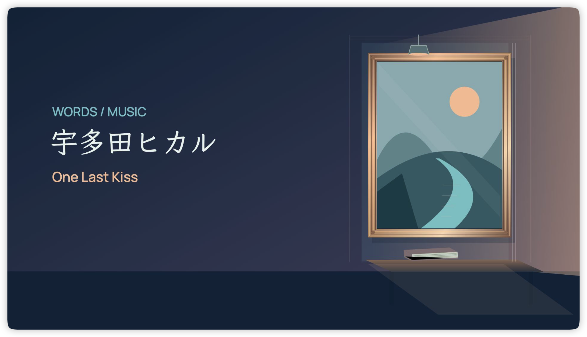

<p align="center">
  
</p>

<p align="center">Turn songs into illustrated lyric films.</p>

<p align="center">
  <a href="#get-started">Get started</a> ·
  <a href="docs/production.md">Production guide</a> ·
  <a href="#workspace">Workspace</a>
</p>

<p align="center">
  
  <br />
  <sub>A frame from the One Last Kiss SVG edition. Artwork and typography are rendered from code.</sub>
</p>

songsmith is a code-first workspace for full-length lyric videos made with React, TypeScript, and [Remotion](https://www.remotion.dev/). Each song has a distinct visual direction, detailed SVG scenes, and expressive typography. Native sung units follow the recording, with nearby Chinese translations for foreign-language vocals.

## From song to film

Scenes develop with the meaning of each phrase. Objects, materials, light, and continuous motion form a complete setting. Lyrics occupy measured positions before appearing, so earlier words stay in place as the line unfolds. Covers, credits, instrumental passages, and endings belong to the same visual story.

One installation serves every song. Model-specific implementations remain independent and share the song's source assets. The default export is a 1920 × 1080, 60 fps MP4. New songs require verified source timing, art direction, and scene implementation.

## Get started

Use Node.js 22.16 or newer and npm 10 or newer. Install the locked dependencies from the repository root, then open Remotion Studio:

```sh
npm ci
npm run studio
```

List the available compositions:

```sh
npm run compositions
```

All render commands are defined in [package.json](package.json). Outputs go to `out/` with the official song title and model name. Rendering uses local assets; it never downloads a replacement lyric.

The One Last Kiss command additionally checks and, only when needed, repairs its exported soundtrack. It requires FFmpeg and FFprobe on PATH and the root Python environment:

```sh
python3 -m venv .venv
.venv/bin/python -m pip install -r requirements.txt
npm run "render:One Last Kiss:gpt-6-astra-svg"
```

The pinned Python dependencies are used for font subsetting and audio checks. Python 3.13 is the tested environment; JavaScript checks and representative renders were run with Node.js 26.7.

## Workspace

Visual implementations live in `src/renders/<official-title>/<model>/`. Each uses Video.tsx as its entry, with local typography, storyboard, and scene modules where needed. [src/Root.tsx](src/Root.tsx) explicitly registers the compositions.

Song audio, structured lyrics, and native source responses live in `public/songs/<official-title>/`. Shared fonts and licenses live in `public/fonts/`; song-specific fonts remain with their song. Preparation scripts live in `scripts/<official-title>/`, and reusable parsing utilities live in `scripts/lib/`.

```text
src/renders/<official-title>/<model>/   Independent film implementations
src/lib/                              Shared timing, type, and font utilities
public/songs/<official-title>/         Audio, lyrics, source evidence, local fonts
public/fonts/                         Shared fonts and licenses
scripts/<official-title>/             Explicit source preparation and film checks
tests/                                Native timing and workspace checks
docs/                                 Production guide and README artwork
out/                                  Exported films, excluded from Git
.work/                                Disposable previews and reports
```

Engineering prose and code identifiers are English. Official titles, artist names, lyrics, and translations retain their own language. Technical Remotion identifiers use ASCII.

Dependencies, local environments, intermediate files in `.work/`, and exports in `out/` are excluded from Git. Source assets and lockfiles remain tracked. A fresh render requires all referenced audio, lyrics, and fonts; installation cannot replace missing assets.

## Maintain a film

Read [AGENTS.md](AGENTS.md) and [the production guide](docs/production.md) before changing visuals or timing. Each implementation README explains its own direction and limitations.

```sh
npm run check
npm run inspect
```

The checks cover ESLint, TypeScript, every song's native unit references, and workspace wiring. Inspection exports representative frames to `.work/inspection/`; it does not perform a full-video anomaly scan or certify lyric-to-vocal listening.

Run a song's prepare.mjs explicitly when rebuilding source references. Existing sources are read offline. Missing source downloads are separate from rendering. Approved display text and translations are retained, with original unit text recorded separately. Rebuild shared font subsets after adding glyphs with `npm run fonts:build`.

For questions or defects, open a repository issue with the composition name, reproduction steps, and relevant output.

## License

The project code and documentation are licensed under the [MIT License](LICENSE). Third-party music, lyrics, fonts, and dependencies retain their respective licenses and are not relicensed by this grant.
